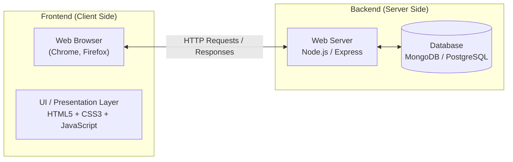

# 01. Web Development Overview, Frontend vs Backend & Role of HTML

> **Timestamp Reference:** `[00:00:00] - [00:04:45]` | **Course:** MERN Stack & Creative Development (Sheryians Coding School)

---

## 1. What is Web Development?

Web development is the process of building, creating, and maintaining websites and web applications that run online in a browser. Every website you interact with (Google, YouTube, Amazon, Spotify) is built using a combination of technologies that handle:
1. **Structure** (what content appears on the screen)
2. **Design & Styling** (how that content looks)
3. **Logic & Interactivity** (how the website behaves when users interact with it)
4. **Data & Servers** (how user accounts, databases, and business logic are stored and served)

---

## 2. Frontend vs Backend Development

A full-stack web application is divided into two primary sides:

### Frontend (Client-Side)
* **What it is:** Everything the user sees, touches, and directly interacts with inside the web browser.
* **Core Triad of Frontend:**
  * **HTML (HyperText Markup Language):** The skeleton and structure of the page.
  * **CSS (Cascading Style Sheets):** The skin, clothes, layout, and visual design.
  * **JavaScript:** The brain, muscles, and functionality that makes the page dynamic and interactive.
* **Environment:** Executes directly inside the client's browser engine (V8 in Chrome, SpiderMonkey in Firefox).

### Backend (Server-Side)
* **What it is:** The behind-the-scenes engine that users do not directly see.
* **Key Responsibilities:** Handling databases, user authentication, APIs, payment processing, security, and business logic.
* **Technologies:** Node.js, Express, Python, databases (MongoDB, PostgreSQL, Redis).
* **Environment:** Executes on remote cloud servers or local server runtimes.

---

## 3. The Human Body Analogy

To intuitively understand the core frontend trio, consider how a human being is formed:

| Component | Web Technology | Responsibility on the Web |
| :--- | :--- | :--- |
| **Skeleton & Bones** | **HTML** | Defines headings, paragraphs, images, buttons, and layout containers. |
| **Skin, Clothes & Makeup** | **CSS** | Defines colors, fonts, margins, padding, animations, and responsive layouts. |
| **Brain & Nervous System** | **JavaScript** | Responds to clicks, validates forms, fetches data from APIs, and toggles dark mode. |

---

## 4. The Specific Role of HTML

* **HTML stands for:** **H**yper**T**ext **M**arkup **L**anguage.
  * **HyperText:** Text that links to other pages or resources (hyperlinks).
  * **Markup Language:** A system of annotating text using **tags** (`<tagname>`) so the browser knows how to structure and interpret the information.
* **Not a Programming Language:** HTML has no logic, loops, variables, or algorithms. It is purely declarative markup.
* **Browser Parser:** The browser reads HTML from top to bottom and constructs the **DOM (Document Object Model)** tree in memory, which is then styled by CSS and made interactive by JavaScript.

---

## 5. Development Environment: VS Code

* **Code Editor vs Simple Text Editor:**
  * While you *could* write HTML in basic Notepad, professional development requires a purpose-built code editor like **Visual Studio Code (VS Code)**.
  * VS Code provides syntax highlighting, auto-completion, Emmet abbreviation shortcuts (e.g. typing `!` generates a full boilerplate), and integrated terminal tooling.
* **Project Folder Workflow:**
  * Websites are organized as project folders. Opening a project directory in VS Code makes all internal files, stylesheets, and assets easily accessible and linked.

---

## Summary Checklist
- [x] Web development is split into **Frontend (client)** and **Backend (server)**.
- [x] Frontend relies on three fundamental pillars: **HTML (Structure)**, **CSS (Style)**, and **JavaScript (Behavior)**.
- [x] HTML uses markup tags to tell browsers what content exists on a webpage.
- [x] VS Code is our primary environment for crafting clean, structured code.
