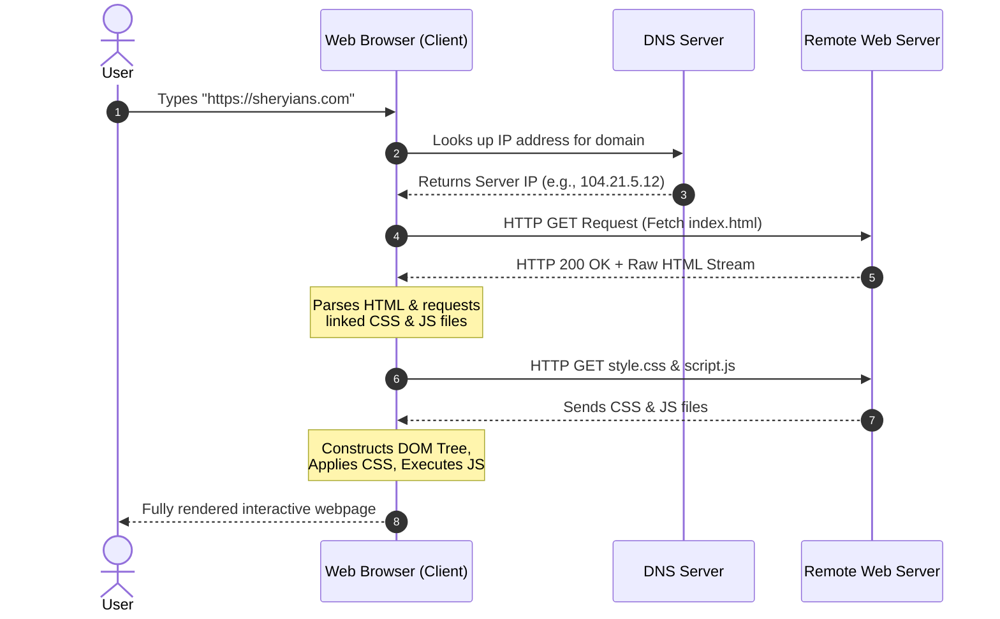

# 02. How the Web Works, Client-Server Basics & HTML as the Structure

> **Timestamp Reference:** `[00:03:36] - [00:07:30]` | **Course:** MERN Stack & Creative Development (Sheryians Coding School)

---

## 1. What is a File & What is a Folder?

To build websites effectively, you must understand how data is organized on a computer and across the internet:

### What is a File?
* A file is a container for a **single type of data or information**.
* Examples:
  * `song.mp3` &rarr; Contains audio waveform data.
  * `video.mp4` &rarr; Contains video frame data and audio tracks.
  * `photo.jpg` &rarr; Contains image pixel data.
  * `index.html` &rarr; Contains text markup defining the webpage structure.

### What is a Folder (Directory)?
* A folder is a **collection or container of files**.
* If you keep your 10th marksheet, 12th marksheet, Aadhaar card, and PAN card scattered loosely, they get lost. A folder gathers and organizes related files into one systematic unit.
* In web development, your project folder (e.g., `web-development-journey/`) bundles all related HTML files, CSS stylesheets, JavaScript scripts, images, and fonts so the browser can easily locate and link them.

---

## 2. Anatomy of a File Name: Name vs Extension

Every file on your system follows a strict naming pattern:

$$\text{File Name} = \underbrace{\text{Base Name}}_{\text{Identifier}} + \mathbf{.} + \underbrace{\text{Extension}}_{\text{Data Type}}$$

```text
       brown_rang . mp3
       └────┬───┘   └─┬─┘
        File Name    File Type (Audio)

       index      . html
       └─┬─┘        └─┬─┘
      File Name      File Type (HyperText Markup)
```

* **Base Name:** The descriptive label you choose (e.g., `index`, `about`, `hero-video`). You can change this anytime.
* **Dot (`.`):** The separator between the name and the extension.
* **Extension:** Tells the operating system and web browser **how to interpret the file's binary contents**.
  * `.html` &rarr; Browser knows to parse it as an HTML document.
  * You cannot arbitrarily change `.html` to `.hotml` or `.txt`, because the browser will fail to recognize and render it as a webpage.

### Why is the primary file named `index.html`?
Web servers around the world (Apache, Nginx, Node.js) are configured by default to look for `index.html` as the **entry point** of any website or directory. When a user navigates to `https://google.com/`, the server automatically delivers `https://google.com/index.html`.

---

## 3. Client-Server Architecture: How the Web Works

Whenever you browse the web, your computer acts as a **Client**, requesting documents from a **Server**:



### The 4 Steps of Web Delivery:
1. **Request:** The user enters a URL or clicks a link. The browser sends an HTTP request over the network.
2. **Server Response:** The remote server locates the requested file (`index.html`) on its storage and sends it back across the internet.
3. **Parsing & DOM Construction:** The browser receives raw text, parses HTML tags from top to bottom, and constructs the in-memory **DOM (Document Object Model)** tree.
4. **Rendering:** The browser displays text, downloads referenced images, applies CSS styling rules, and executes JavaScript logic.

---

## 4. HTML as the Structural Foundation

* **The Web's Skeleton:** HTML provides the necessary anchors and containers for all other technologies.
* **Without HTML:**
  * **CSS** has no elements or layout to apply colors, margins, or fonts to.
  * **JavaScript** has no buttons or text to listen to or manipulate.
* Every webpage begins with pure HTML structure before any aesthetics or functionality are layered on top.

---

## Summary Checklist
- [x] Files store a single type of data; folders organize collections of files.
- [x] File extensions (`.html`, `.css`, `.js`) dictate how operating systems and browsers interpret file contents.
- [x] `index.html` is the globally recognized standard entry point for web servers.
- [x] The web operates on a **Client-Server model** where browsers request HTML and servers deliver it.
- [x] Browsers parse HTML documents sequentially to construct the DOM tree.
